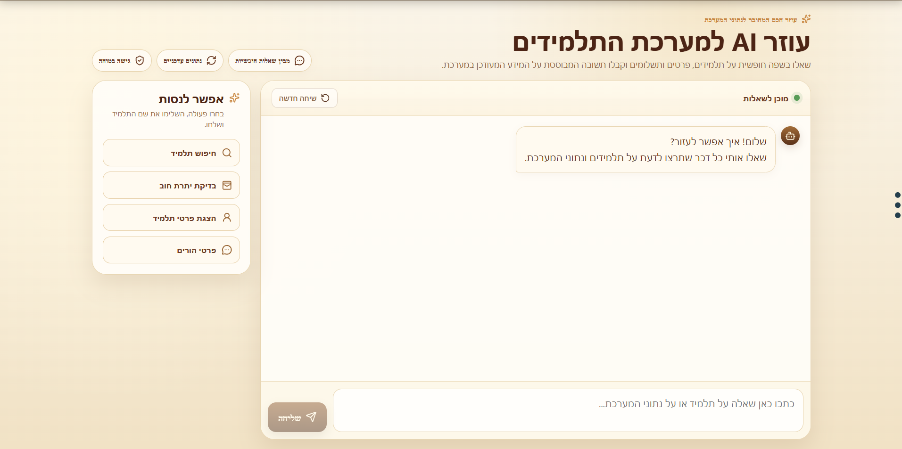
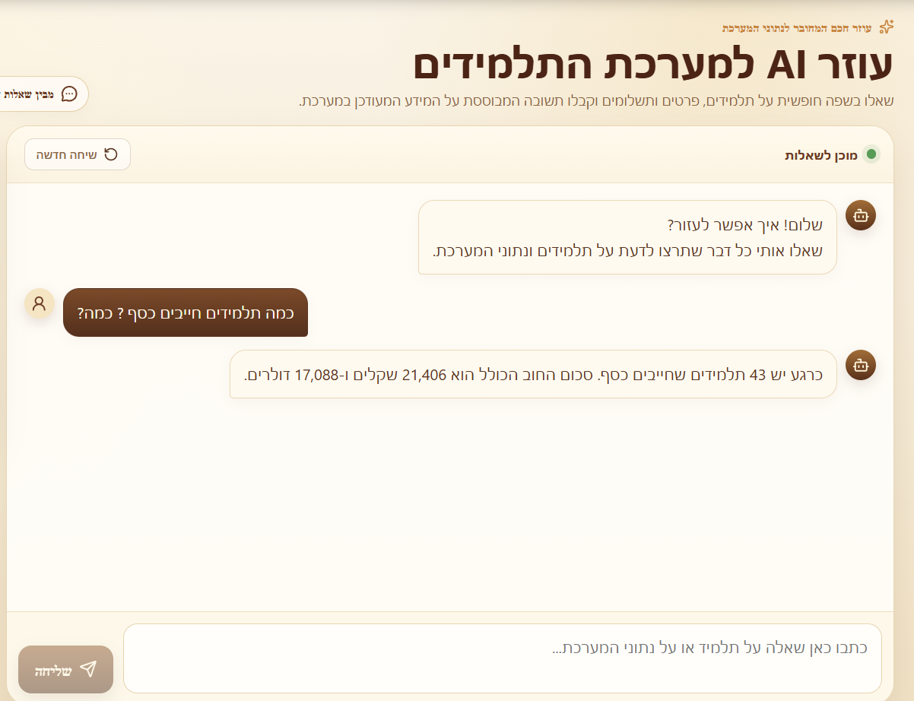

# AI-Powered Student Management System

A full-stack management system built with **React, TypeScript, Supabase, PostgreSQL and OpenAI**, featuring an integrated AI assistant for natural-language access to structured application data.

The application was developed as a real-world management system and later extended with an AI layer that allows users to retrieve information without manually navigating between multiple screens.

The interface is designed for Hebrew-speaking users and includes full **RTL support**.

---

## Overview

The system provides centralized management of student records, contact information, payments and organizational data.

In addition to the traditional user interface, the application includes an AI assistant that enables users to ask questions in natural language and receive answers based on live data stored in Supabase.

Examples include:

- Finding a student by name
- Retrieving student details
- Checking payment balances
- Retrieving contact information
- Searching students by location
- Answering aggregate questions about system data

---

## AI Assistant

The AI assistant is implemented using **OpenAI Tool Calling**.

Instead of giving the language model unrestricted access to the database or allowing it to generate arbitrary SQL, the backend exposes a controlled set of predefined tools.

The model:

1. Understands the user's natural-language request
2. Selects the appropriate tool
3. Calls a Supabase Edge Function
4. Retrieves structured data from PostgreSQL
5. Generates a clear natural-language response

This architecture provides a safer and more predictable way to integrate AI with structured organizational data.

---

## Screenshots

### AI Assistant



A dedicated conversational interface that allows non-technical users to query system data using everyday language.

### Natural-Language Data Query



The assistant can perform aggregate queries over live system data and return a readable answer without requiring the user to write SQL or manually build reports.

### Student Profile


A structured student profile displaying relevant information in a clear RTL interface.

---

## Architecture

```text
User
  ↓
React + TypeScript Frontend
  ↓
Supabase Edge Function
  ↓
OpenAI LLM
  ↓
Tool Calling
  ↓
Controlled Application Tools
  ↓
Supabase / PostgreSQL
  ↓
Structured Result
  ↓
Natural-Language Response
